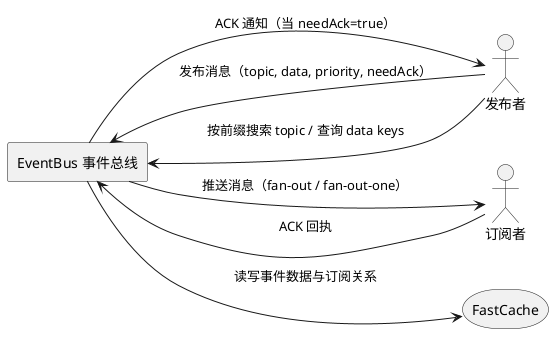
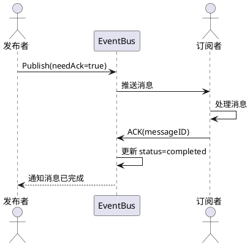

# **1. 组件定位**

## **1.1 核心职责**

本组件负责提供基于发布-订阅模式的事件总线服务，实现消息的发布、订阅与分发，支持 fan-out 和竞争消费两种送达模式。

## **1.2 核心输入**

1. **发布请求**：调用方发送包含 topic、data、priority、needAck 等字段的消息发布请求
2. **订阅请求**：消费方发起对指定 topic 的订阅请求
3. **ACK 回执**：消费方在处理完消息后发送确认回执
4. **查询请求**：调用方按前缀搜索 topic 列表，或查询指定 topic 下 data 的 key 列表

## **1.3 核心输出**

1. **消息推送**：根据送达模式将消息推送给一个或多个订阅者
2. **ACK 通知**：当消息被消费完成且 needAck 为 true 时，通知发送方
3. **查询结果**：返回匹配前缀的 topic 列表或指定 topic 下 data 的 key 列表
4. **错误响应**：当输入校验失败或业务规则冲突时返回错误信息

## **1.4 职责边界**

1. 本组件**不负责**消息的持久化存储，消息生命周期由 FastCache 的缓存策略决定
2. 本组件**不负责**消费方的业务逻辑执行，仅负责消息的分发与回执
3. 本组件**不负责**跨进程或跨网络的通信传输，仅提供进程内的事件总线能力
4. 本组件**不负责**用户认证与权限控制
5. 本组件**不负责**消息的过期与TTL管理，消息无过期时间

---

# **2. 领域术语**

**Event（事件/消息）**
: 由发布方产生、通过事件总线分发至订阅方的消息载体，包含 topic、data、status、priority、needAck 等属性。

**Topic（主题）**
: 事件的分类标识，采用冒号分隔的前缀式命名，用于组织和隔离不同业务领域的事件。前缀层级即为逻辑分组，例如 `db:create` 表示 db 分组下的 create 事件，`app:db:create` 表示 app 下的 db 分组下的 create 事件。订阅方通过 topic 定位感兴趣的事件流。

**Fan-out（全量分发）**
: 一种消息送达模式，将消息推送到该 topic 下的所有订阅者。

**Fan-out-one（竞争消费）**
: 一种消息送达模式，将消息仅推送到该 topic 下的任意一个订阅者。

**Priority（优先级）**
: 事件的优先级标识，取值范围为 1~5，数值越大优先级越高。优先级影响消息的分发顺序。

**ACK（回执确认）**
: 消费方在完成消息处理后向事件总线发送的确认信号。当事件的 needAck 为 true 时，事件总线需将回执通知发送方。

**Status（消息状态）**
: 事件在生命周期中的状态标识，包括待分发（pending）、已分发（delivered）、已完成（completed）。

**Topic Registry（主题注册表）**
: 记录系统中已存在的所有 topic 及每个 topic 下 data 字段的所有 key 的注册表，用于查询和检索。

---

# **3. 角色与边界**

## **3.1 核心角色**

1. **发布者（Publisher）**：向事件总线发送消息的调用方，负责指定 topic、data、priority、needAck 等属性
2. **订阅者（Subscriber）**：从事件总线接收消息的调用方，负责处理消息并在 needAck 为 true 时发送回执

## **3.2 外部系统**

1. **FastCache**：作为底层存储引擎，提供高速缓存能力，用于存储事件数据、订阅关系和状态信息

## **3.3 交互上下文**



---

# **4. DFX约束**

## **4.1 性能**

1. 单次消息发布的响应时间**应当**不超过 1ms（不含订阅者处理时间）
2. 单次消息分发的响应时间**应当**不超过 1ms
3. 系统吞吐量下限**应当**不低于 10万 ops/秒（单实例）

## **4.2 可靠性**

1. 消息在分发前**必须**保证不丢失（依赖 FastCache 的内存可靠性）
2. 当 needAck 为 true 时，ACK 回执**必须**可靠送达发送方
3. 竞争消费模式下，同一条消息**必须**仅被一个订阅者消费

## **4.3 安全性**

1. 本组件为进程内组件，不涉及网络传输安全要求
2. 待定：是否需要限制 topic 的命名规范以防止注入

## **4.4 可维护性**

1. 关键操作（消息发布、分发、ACK回执）**应当**输出日志
2. **应当**提供运行时统计信息，包括各 topic 的消息计数

## **4.5 兼容性**

1. Go 语言版本**应当**兼容 Go 1.21 及以上
2. FastCache 版本**应当**兼容 github.com/VictoriaMetrics/fastcache 最新稳定版

## **4.6 时间约束**

1. 所有时间字段**必须**使用 int64 类型的 Unix 时间戳（秒级），禁止使用 time.Time 对象
2. 若需格式化时间展示，**必须**使用操作系统本地时区，禁止硬编码时区

---

# **5. 核心能力**

## **5.1 消息发布**

### **5.1.1 业务规则**

1. **消息必填字段校验**：发布消息时，topic、data **必须**非空
   - 验收条件：When 发布消息时 topic 为空 → the EventBus shall 返回校验错误
   - 验收条件：When 发布消息时 data 为空 → the EventBus shall 返回校验错误

2. **Topic 命名规范**：topic **必须**采用冒号分隔的前缀式命名，支持多层前缀（如 `db:create`、`app:db:create`），各段**必须**为非空字符串
   - 验收条件：When 发布消息时 topic 为合法前缀式命名（如 `db:create`） → the EventBus shall 接受该消息
   - 验收条件：When 发布消息时 topic 包含空段（如 `db::create`） → the EventBus shall 返回校验错误
   - 验收条件：When 发布消息时 topic 以冒号开头或结尾（如 `:db:create` 或 `db:create:`） → the EventBus shall 返回校验错误

3. **优先级取值范围**：priority 取值**必须**为 1~5 的整数，默认值为 1
   - 验收条件：When 发布消息时 priority 为 0 → the EventBus shall 返回校验错误
   - 验收条件：When 发布消息时 priority 为 6 → the EventBus shall 返回校验错误
   - 验收条件：When 发布消息时未指定 priority → the EventBus shall 使用默认值 1

4. **消息创建时间戳**：消息创建时**必须**自动生成 created 时间戳（int64 Unix 时间戳，秒级）
   - 验收条件：When 消息创建成功 → the EventBus shall 自动填充 created 字段为当前 Unix 时间戳（int64）

5. **消息初始状态**：消息创建后**必须**将 status 设置为 pending
   - 验收条件：When 消息创建成功 → the EventBus shall 将 status 设置为 pending

6. **needAck 默认值**：needAck 默认为 false
   - 验收条件：When 发布消息时未指定 needAck → the EventBus shall 将 needAck 设置为 false

7. **无订阅者时不存储消息**：当消息发布时该 topic 无任何订阅者，EventBus **必须**执行空操作，不存储消息
   - 验收条件：When 发布消息时该 topic 无任何订阅者 → the EventBus shall 不存储该消息，不写入 FastCache，不加入待分发队列，不记录 topic 注册表
   - 验收条件：When 发布消息时该 topic 存在订阅者 → the EventBus shall 正常存储该消息

8. **Topic 注册**：当消息成功发布时，EventBus **必须**将该 topic 注册到主题注册表中，并记录 data 字段的所有 key
   - 验收条件：When 消息发布成功 → the EventBus shall 将该 topic 添加到主题注册表
   - 验收条件：When 消息发布成功 → the EventBus shall 将 data 中的所有 key 添加到该 topic 的 key 集合中

9. **禁止项**：禁止发布 topic 包含非法字符的消息
   - 验收条件：When topic 包含空字符串 → the EventBus shall 返回校验错误

### **5.1.2 交互流程**

```plantuml
@startuml
actor "发布者" as Publisher
participant "EventBus" as EventBus
storage "FastCache" as Cache

Publisher -> EventBus : Publish(topic, data, priority, needAck)
EventBus -> EventBus : 校验必填字段与优先级
EventBus -> EventBus : 检查该 topic 是否存在订阅者
alt 存在订阅者
    EventBus -> Cache : 存储消息（status=pending, created=now）
    EventBus -> EventBus : 注册 topic 及 data keys
    EventBus -> EventBus : 根据送达模式分发消息
    EventBus --> Publisher : 返回消息ID
else 无订阅者
    EventBus --> Publisher : 返回空操作结果（不存储消息）
end
@enduml
```

### **5.1.3 异常场景**

1. **必填字段缺失**
   - 触发条件：发布消息时 topic 或 data 为空
   - 系统行为：拒绝发布，返回校验错误
   - 用户感知：返回错误信息，提示必填字段缺失

2. **Topic 命名不合法**
   - 触发条件：topic 不符合前缀式命名规范（含空段、以冒号开头或结尾等）
   - 系统行为：拒绝发布，返回校验错误
   - 用户感知：返回错误信息，提示 topic 命名规范

3. **优先级越界**
   - 触发条件：priority 不在 1~5 范围内
   - 系统行为：拒绝发布，返回校验错误
   - 用户感知：返回错误信息，提示优先级取值范围

4. **FastCache 写入失败**
   - 触发条件：FastCache 存储空间不足或不可用
   - 系统行为：返回存储失败错误
   - 用户感知：返回错误信息，提示存储失败

---

## **5.2 消息订阅**

### **5.2.1 业务规则**

1. **订阅注册**：订阅者**必须**通过 topic 进行订阅，同时指定送达模式（fan-out 或 fan-out-one）
   - 验收条件：When 订阅者注册订阅 → the EventBus shall 记录订阅者与 topic 的绑定关系及送达模式

2. **fan-out 模式分发**：当送达模式为 fan-out 时，消息**必须**推送到该 topic 下的所有订阅者
   - 验收条件：When fan-out 模式下有新消息且存在 3 个订阅者 → the EventBus shall 将消息推送到全部 3 个订阅者

3. **fan-out-one 模式分发**：当送达模式为 fan-out-one 时，消息**必须**仅推送到该 topic 下的任意一个订阅者
   - 验收条件：When fan-out-one 模式下有新消息且存在 3 个订阅者 → the EventBus shall 将消息推送到其中 1 个订阅者

4. **优先级分发顺序**：消息分发**必须**按优先级从高到低进行，同优先级按创建时间先后排序
   - 验收条件：When 存在 priority=5 和 priority=1 的两条待分发消息 → the EventBus shall 优先分发 priority=5 的消息

5. **取消订阅**：订阅者**必须**能够取消对指定 topic 的订阅
   - 验收条件：When 订阅者取消订阅 → the EventBus shall 移除该订阅关系，后续消息不再推送给该订阅者

6. **全部订阅者取消后新消息不存储**：当某 topic 的所有订阅者均取消订阅后，该 topic 新发布的消息**必须**不存储（同无订阅者规则）
   - 验收条件：When 某 topic 的所有订阅者均取消订阅后发布新消息 → the EventBus shall 不存储该消息

### **5.2.2 交互流程**

```plantuml
@startuml
actor "订阅者" as Subscriber
participant "EventBus" as EventBus
storage "FastCache" as Cache

Subscriber -> EventBus : Subscribe(topic, mode, handler)
EventBus -> Cache : 存储订阅关系
EventBus --> Subscriber : 返回订阅确认

== 消息到达时 ==

EventBus -> EventBus : 查询 topic 的订阅者列表
EventBus -> Subscriber : 推送消息（按 mode 决定 fan-out 或 fan-out-one）

Subscriber -> EventBus : Unsubscribe(topic)
EventBus -> Cache : 移除订阅关系
EventBus --> Subscriber : 返回取消确认
@enduml
```

### **5.2.3 异常场景**

1. **订阅已存在的 topic**
   - 触发条件：同一订阅者重复订阅同一 topic
   - 系统行为：更新订阅信息（覆盖送达模式），不重复添加
   - 用户感知：返回订阅确认，不报错

2. **取消不存在的订阅**
   - 触发条件：订阅者取消一个未注册的订阅
   - 系统行为：忽略该操作
   - 用户感知：返回操作成功，无错误

---

## **5.3 ACK 回执机制**

### **5.3.1 业务规则**

1. **回执触发条件**：仅当消息的 needAck 为 true 时，订阅者**必须**在处理完成后发送 ACK 回执
   - 验收条件：When needAck=true 的消息被消费完成 → the EventBus shall 要求订阅者发送 ACK 回执
   - 验收条件：When needAck=false 的消息被消费完成 → the EventBus shall 不要求 ACK 回执

2. **回执通知发送方**：当收到 ACK 回执后，EventBus **必须**通知消息的发送方
   - 验收条件：When EventBus 收到订阅者的 ACK 回执且 needAck=true → the EventBus shall 通知消息发送方该消息已完成

3. **消息状态流转**：消息状态**必须**按 pending → delivered → completed 流转
   - 验收条件：When 消息被推送到订阅者 → the EventBus shall 将 status 更新为 delivered
   - 验收条件：When 收到 ACK 回执 → the EventBus shall 将 status 更新为 completed

4. **禁止项**：禁止对 needAck=false 的消息发送 ACK 回执
   - 验收条件：When 对 needAck=false 的消息发送 ACK → the EventBus shall 忽略该回执

### **5.3.2 交互流程**



### **5.3.3 异常场景**

1. **重复 ACK**
   - 触发条件：同一消息收到多次 ACK 回执
   - 系统行为：仅处理第一次 ACK，忽略后续重复回执
   - 用户感知：无额外通知

2. **对已完成消息发送 ACK**
   - 触发条件：对 status=completed 的消息发送 ACK
   - 系统行为：忽略该回执
   - 用户感知：无错误返回

---

## **5.4 查询接口**

### **5.4.1 业务规则**

1. **按前缀搜索 topic 列表**：**必须**提供接口按前缀搜索所有匹配的 topic
   - 验收条件：When 搜索前缀 `db:` → the EventBus shall 返回所有以 `db:` 开头的 topic（如 `db:create`、`db:update`、`db:delete`）
   - 验收条件：When 搜索前缀 `app:db:` → the EventBus shall 返回所有以 `app:db:` 开头的 topic（如 `app:db:create`、`app:db:update`）
   - 验收条件：When 搜索前缀为空字符串 → the EventBus shall 返回所有已注册的 topic
   - 验收条件：When 搜索前缀无匹配的 topic → the EventBus shall 返回空列表

2. **列出所有 topic**：**必须**提供接口列出所有已注册的 topic
   - 验收条件：When 列出所有 topic → the EventBus shall 返回主题注册表中所有 topic 名称列表

3. **查询 topic 下 data 的 key 列表**：**必须**提供接口查询指定 topic 下消息 data 字段的所有 key
   - 验收条件：When 查询指定 topic 的 data keys → the EventBus shall 返回该 topic 下累积的所有 data key 名称列表
   - 验收条件：When 查询不存在的 topic 的 data keys → the EventBus shall 返回空列表

### **5.4.2 交互流程**

```plantuml
@startuml
actor "调用方" as Caller
participant "EventBus" as EventBus
storage "FastCache" as Cache

Caller -> EventBus : ListTopicsByPrefix(prefix)
EventBus -> Cache : 搜索匹配前缀的 topic 集合
EventBus --> Caller : 返回匹配的 topic 列表

Caller -> EventBus : ListAllTopics()
EventBus -> Cache : 查询所有已注册 topic
EventBus --> Caller : 返回所有 topic 列表

Caller -> EventBus : ListDataKeys(topic)
EventBus -> Cache : 查询 topic 下消息的 data keys
EventBus --> Caller : 返回 key 列表
@enduml
```

### **5.4.3 异常场景**

1. **topic 参数为空**
   - 触发条件：查询 data keys 时 topic 参数为空字符串
   - 系统行为：返回校验错误
   - 用户感知：返回错误信息，提示参数不能为空

---

# **6. 数据约束**

## **6.1 Event（事件/消息）**

1. **topic**：事件的主题标识，**必须**为非空字符串，采用冒号分隔的前缀式命名（如 `db:create`、`app:db:create`），长度不超过 256 字符，各段**必须**为非空字符串，禁止以冒号开头或结尾
2. **data**：事件的负载数据，**必须**为 map[string]interface{} 类型的哈希表，**必须**非空（至少包含一个 key-value 对）
3. **status**：事件的状态，取值范围为 pending、delivered、completed，**必须**由系统自动管理
4. **priority**：事件的优先级，取值范围为 1~5 的整数，默认值为 1
5. **needAck**：是否需要 ACK 回执，取值为 true 或 false，默认值为 false
6. **created**：事件创建时间戳，**必须**为 int64 类型的 Unix 时间戳（秒级），由系统自动生成

## **6.2 Subscription（订阅关系）**

1. **topic**：订阅的主题标识，**必须**为非空字符串
2. **mode**：送达模式，取值范围为 fan-out 或 fan-out-one，**必须**在订阅时指定
3. **subscriberID**：订阅者的唯一标识，**必须**为非空字符串

## **6.3 Data（事件负载）**

1. **key**：data 哈希表中的键，**必须**为非空字符串
2. **value**：data 哈希表中的值，类型为 interface{}，允许为 nil

## **6.4 Topic Registry（主题注册表）**

1. **topic**：已注册的主题名称，**必须**为合法的前缀式命名
2. **dataKeys**：该 topic 下累积的所有 data key 集合，**必须**随消息发布持续累积
